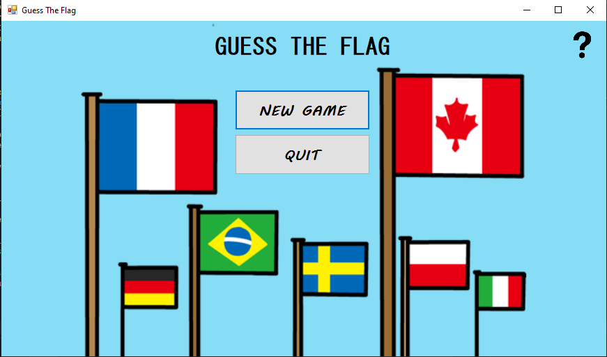
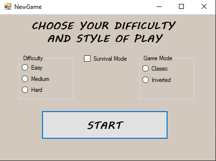
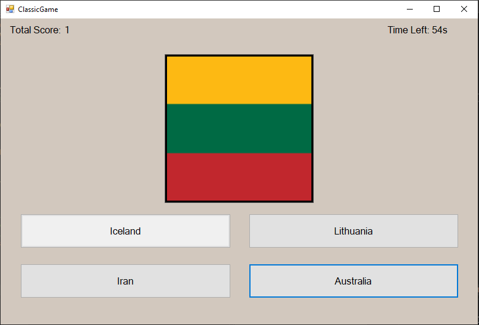
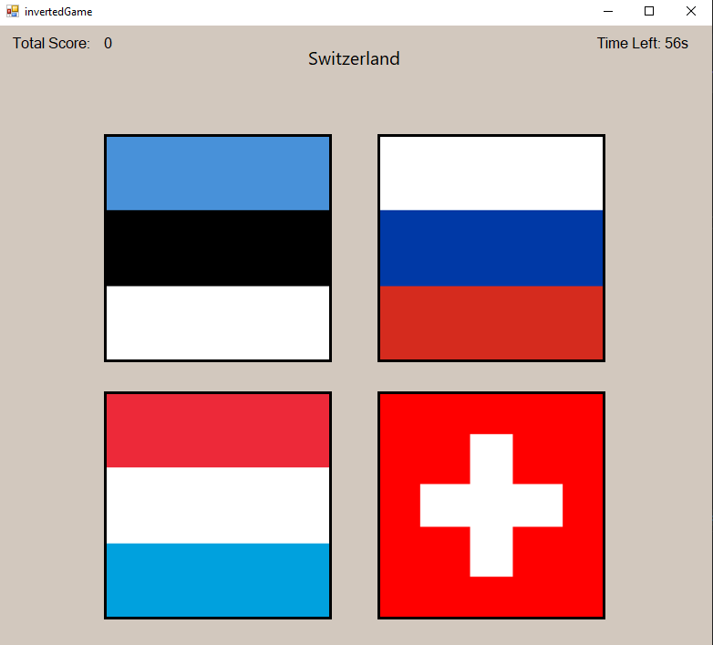

# Guess The Flag

C# Windows Forms проект од: Никола Василевски.  
C# Windows Forms project by: Nikola Vasilevski.

## 1. Опис на апликацијата / Application Description

Во овој проект е имплементирана играта **Guess the Flag**, со додавање на уште еден начин на играње - **Inverted Mode**.  
In this project I implemented the game **Guess the Flag**, with an additional game mode called **Inverted Mode**.

## 2. Решение на проблемот / Problem Solution

Апликацијата работи со сет од држави и нивни сликички со знамиња.  
The app works with a set of countries and their corresponding flag images.

Овие податоци се чуваат во класа `Flag`:  
These are stored in a `Flag` class:

```csharp
namespace Guess_The_Flag
{
    public class Flag
    {
        public string CountryName { get; set; } 
        public string ImagePath {  get; set; }

        public Flag(string countryName, string imagePath) { 

            CountryName = countryName;
            ImagePath = imagePath;
        }
    }
}
```
Сите знамиња се чуваат во List<Flags> која е иницијализирана во класите `ClassicGame` и `InvertedGame`

Методот `ShowNewFlagQuestion` е одговорен за прикажување на ново прашање односно нова држава/ The method `ShowNewFlagQuestion` is responsible for displaying a new flag on the screen

```csharp
do
{
    currentFlag = flags[rng.Next(flags.Count)];
}
while (previousFlag != null && currentFlag.CountryName == previousFlag.CountryName);

```
Со овој метод се избира знаме што е различно од претходното, истовремено генерира и различни три неточни одговори, и се прикажуваат на екран.
This method picks a flag that is different from the previous onewhile also generating 3 different wrong options and displayes them on the screen.

## 2. Упатство за користење / How to Use

### 2.1 Нова игра / New Game



На почетното мени при стартување на апликацијата, може да започнете нова игра со кликање на копчето **New Game**, каде што се отвора нов прозорец во кој вие си го бирате начинот на играње.  
From the main menu, you can start a new game by clicking the **New Game** button, which opens a new window where you select your game mode.

### 2.2 Поставки / Settings



Во овој прозорец имате можност да изберете ниво на тежина на кое ќе играте. Постојат 3 опции:  
In this window, you can choose the difficulty of your game. There are 3 options:

**Easy/Лесно**  
**Medium/Средно**  
**Hard/Тешко**

Потоа, можете да изберете еден од два понудени начини на игра:  
Then, you can choose between the two game modes:

**Classic Game**  
**Inverted Game**

## Како се игра / How to Play

- Погодете ја точната држава која е прикажана на екранот.  
  Guess the correct country shown on the screen.  
- Секоја игра трае 60 секунди.  
  Each game lasts 60 seconds.  
- Секој точен одговор го зголемува вкупниот резултат.  
  Each correct answer increases your score.  
- Неточните одговори не одземаат поени.  
  Wrong answers do not subtract points.  
- Во горниот лев агол има лабела што го прикажува бројот на точни одговори.  
  A label in the top-left shows your number of correct answers.  
- Во горниот десен агол се прикажува колку време останува.  
  A label in the top-right shows how much time is left.  
- За секој точен или неточен одговор има соодветна мелодија што ќе ја слушнете после секој одговор.  
  A specific sound is played after every correct or wrong answer.

---

## Начини на игра / Game Modes

### Класична игра / Classic Game

- Се прикажува случајно избрано **знаме** на екран.  
  A random **flag** is shown on the screen.  
- Се појавуваат 4 копчиња: 1 точен и 3 неточни одговори.  
  4 buttons appear: 1 correct and 3 incorrect answers.  
- Ако погодите точно:  
  If you answer correctly:  
  - Се пушта звук што укажува дека одговорот е точен. / A sound is played indicating that your guess is correct.  
  - Копчето станува зелено. / The button turns green.  
- Ако згрешите:  
  If you're wrong:  
  - Се пушта звук што укажува дека одговорот е неточен. / A sound is played indicating that your guess is incorrect.  
  - Копчето станува црвено. / The button turns red.

### Инверзна игра / Inverted Game

- Се прикажува **име на држава** наместо знаме.  
  The **name of a country** is shown instead of a flag.  
- Прикажани се 4 знамиња, од кои само едно е точно.  
  4 flags are shown, only one is correct.  
- Секој точен или неточен одговор репродуцира соодветен звук.  
  Each correct or wrong answer plays an appropriate sound.

---

## Бонус – Survival / Bonus Mode – Survival

- Може да се активира заедно со било кој начин на играње.  
  Can be enabled alongside any game mode.  
- Играчот почнува со **3 животи**.  
  The player starts with **3 lives**.  
- Секој погрешен одговор одзема **1 живот**.  
  Each wrong answer subtracts **1 life**.  
- Играта завршува кога ќе изгубите сите 3 животи.  
  The game ends when you lose all 3 lives.

---

## Туторијал / Tutorial

### Почетно мени / Main Menu

- Кликнете на **New Game** за да започнете.  
  Click **New Game** to start.  
- Во горниот десен агол со клик на прашалникот ќе се прикажат правилата.  
  Click the question mark in the top-right to view the rules.  
  

### Класична игра / Classic Mode

- На екранот ќе се појави знаме.  
  A flag will appear on screen.  
- Изберете го точниот одговор од четирите понудени.  
  Choose the correct answer from four options.  
- Точен одговор = звук и зелено копче.  
  Correct answer = sound + green button.  
- Неточен одговор = друг звук и црвено копче.  
  Wrong answer = different sound + red button.  
  

### Инверзна игра / Inverted Mode

- Прикажано е име на држава.  
  A country name is displayed.  
- Одберете го вистинското знаме.  
  Choose the correct flag.  
  

### Поставки / Settings

- Отворете ги поставките од менито.  
  Open the settings from the main menu.  
- Селектирајте режим на игра и активирајте Survival.  
  Select game mode and enable Survival mode.  
  

---

## Автор / Author

Изработено од **Никола Василевски**  
Created by **Nikola Vasilevski**
